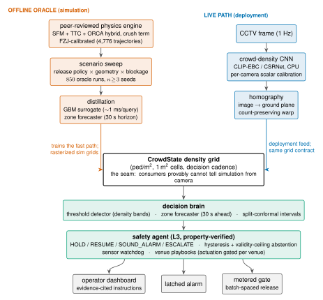
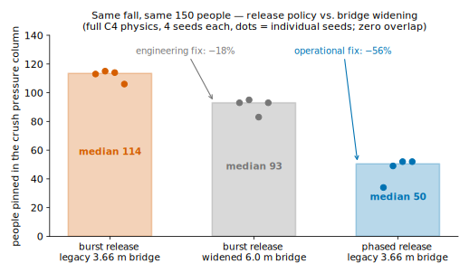
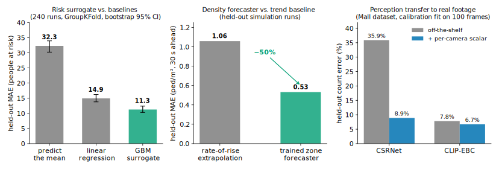

# Pravah — Predictive Crowd-Safety Intelligence


**Predict where and when a crowd turns dangerous — minutes before it is
visible — and know which intervention prevents it.**

Built from a peer-reviewed pedestrian-physics engine (SIMULTECH 2026,
calibrated on 4,776 real trajectories), distilled into a millisecond-fast ML
brain, behind a clean seam that any CCTV camera can plug into. Motivated by
the New Delhi foot-overbridge crush (Feb 2025) and every disaster that shares
its mechanism.

## Architecture — the seam is the point

<p align="center">
  
</p>

Two producers, one contract. The offline lane runs the validated physics as a
slow ground-truth oracle and distills it into fast learned components; the
live lane converts camera frames into the same ground-plane density grid. The
brain consumes only `CrowdState` grids and **provably cannot tell simulation
from camera** — automated tests enforce the contract on both providers. That
is what makes a venue pilot a configuration exercise rather than an
integration project, and what lets slow, validated physics train the fast,
deployable decision layer.

## The headline result

Reconstructing the real disaster mechanism — a fall blocking a crowded
foot-overbridge mid-surge — under the full C4 physics, 150 agents, 4 seeds
per arm:

<p align="center">
  
</p>

| Same fall, same 150 people | In the crush pressure column (per-seed) |
|---|---|
| Burst release, legacy 3.66 m bridge | 106, 113, 114, 115 |
| Burst release, widened 6.0 m bridge | 83, 93, 93, 95 |
| **Phased release, legacy bridge** | **34, 49, 52, 52** |

The distributions do not overlap. The operational fix (phased release, −56%)
outperforms the engineering fix (bridge widening, −18%) threefold, on
unmodified infrastructure — and the two compound. *You can't always prevent
the fall; release policy decides how many people are standing in its blast
radius.*

## Measured comparisons — every learned component vs. its baseline

No learned component ships unless it beats the honest cheap alternative on
held-out data. All three did; the margins below are regenerable from the
scripts in `scripts/`.

<p align="center">
  
</p>

| Component | Baseline | Pravah | Protocol |
|---|---|---|---|
| Risk surrogate (people at risk) | predict-the-mean 32.3 · linear 14.9 | **GBM 11.3** (95% CI 10.3–12.4) | 240 oracle runs, GroupKFold by configuration, bootstrap CIs |
| Density forecaster (ped/m², 30 s ahead) | rate-of-rise extrapolation 1.06 | **0.53** (−50%) | held-out runs — no window from a training run is ever scored |
| Perception on real footage (count error) | CSRNet off-the-shelf 35.9% | **8.9%** calibrated · CLIP-EBC **6.7%** | Mall dataset; scalar fit on 100 frames, error on held-out frames |

Three comparisons worth reading closely:

- **The surrogate answers in ~1 ms what the oracle answers in ~15–20 min** (a
  full C4 physics run at 150 agents) — a ~10⁶× speedup at a quantified
  accuracy cost (MAE 11.3 on a 22–122 range), which is what makes what-if
  policy queries interactive. A C4 confirmation pass showed the cheaper
  training labels track the full physics within ~6 people with the policy
  ranking preserved 10/10.
- **The forecaster halves trend extrapolation** precisely where it matters:
  extrapolation overshoots during saturation (predicting indefinitely rising
  density where the crowd jams), which is what triggers false escalations in
  a naive system.
- **Per-camera calibration, not model swapping, closes the deployment gap**:
  a single scalar fit on 100 frames takes an off-the-shelf counting CNN from
  35.9% to 8.9% error; the stronger CLIP-EBC transfers near-bias-free
  (×1.003) and lands at 6.7% — residual variance, not correctable bias.

## Quickstart (fresh clone, CPU-only)

```bash
pip install -e .                      # core (numpy/scipy/shapely/sklearn...)
pytest tests/ -q                      # 165 tests, ~5-10 min
python scripts/quickstart_demo.py     # ~3 min of simulation, then opens the
                                      # control room at http://localhost:8750
```

The dashboard shows both release policies side by side: live density grid,
latched alarm ladder (watch/amber/critical), pressure-column trend, a 30 s
forecast, and the physics-ranked intervention playbook.

### Run it on real footage

```bash
pip install -e .[perception]          # + opencv, torch, huggingface_hub
python scripts/phaseA_calibrate.py --points cam.json --out calib.json --frame f.jpg
python scripts/phaseA_demo.py --frames <dir> --calib calib.json --out demo.mp4
```

Perception uses MIT-licensed pretrained crowd-density CNNs (CPU, ~3–6
s/frame — ample at the 1 Hz decision cadence). Measured accuracy bound on 316
ground-truth benchmark images: MAE 22.6 (CSRNet) / 12.2 (CLIP-EBC), with a
known dense-scene undercount; per-camera calibration corrects it during
onboarding (see the perception panel above).

## The safety agent

Above the detector/forecaster sits a conditional-autonomy agent
(`sim/agent.py`) that senses, advises, and acts: it holds and resumes a
metered release gate, latches alarms, and escalates to a human with
evidence-cited instructions. Its invariants are property-verified
(hypothesis-generated input streams): corrupt or stale sensor input can never
actuate, resume requires a sustained clean-and-clear window, alarms fire at
most once per episode, instructions never quote densities beyond the model's
validity ceiling, and venues without gates can never receive gate commands.
Closed-loop, forecast-triggered holds reduced the pinned crowd on all 4/4
seeds tested.

## Honesty, by construction

Every result ships with its validity bounds: the physics' emergent density
ceiling and OOD bias, the perception model's measured undercount and its
direction (alarms-late), the surge-state assumptions (all `[ASSUMPTION]`-
tagged), and per-seed distributions rather than favorable subsets. See
`PROPOSAL.md` for the full evidence summary.

## Repository layout

```
sim/                the engine + the brain (core, steering, density,
                    scenarios, providers, detector, forecaster, perception,
                    agent, conformal)
scripts/            experiments, training, validation, demos (phase-stamped)
dashboard/          the control room (stdlib server + one HTML page)
onboard/            camera calibration examples & procedure
docs/               README figures (TikZ/matplotlib sources included)
tests/              165 tests — the contract
PROPOSAL.md         the evidence summary, every number regenerable
```

## Data & licensing notes

This repo ships **no third-party footage or datasets**. All project code is
MIT-licensed (see `LICENSE`), matching the dependency stack. Peer-reviewed
core: Gang & Veluri, SIMULTECH 2026.
